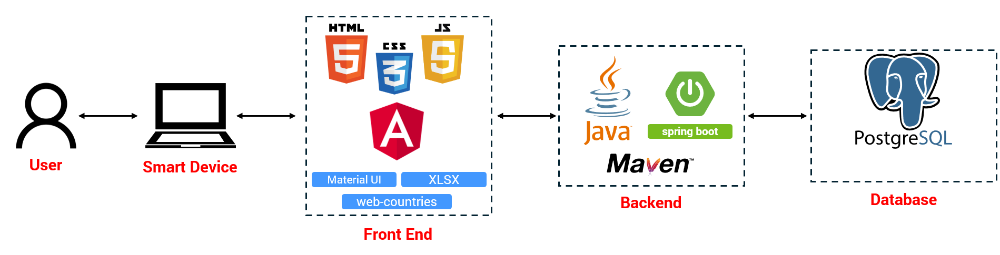

# CRUD Client — Full Stack (Angular 17 + Spring Boot 3.3.x, Java 21, PostgreSQL)

The CRUD Client application is a full-stack system for **managing client records end-to-end**. The Angular 17 frontend (stand-alone components with Angular Material, Signals, and new control-flow) provides a modern table-driven UX with **search, sort, pagination, multi-select, bulk delete, import/export, and live updates**.

The Java 21 / Spring Boot 3.3.x backend exposes a clean REST API with **SSE (Server-Sent Events)** for real-time notifications, persists data in **PostgreSQL**, and enforces input validation and unique constraints.

The result is a **fast, collaborative, and robust** CRUD experience that stays in sync across multiple users.

- **Frontend:** Angular 17 (stand-alone components), **Node.js 20**. Angular Material, XLSX, world-countries, flag-icons
- **Backend:** Java 21, Spring Boot **3.3.x**, Maven **3.9.x**, JPA, SSE
- **Database:** **PostgreSQL**

## Table of Contents

- Application Description
- Required Features
- Optional Features
- Value-Added Features
- Setup (How to run)
- API Overview
- Bulk Import Payloads
- Events (SSE)
- Testing & Coverage
- Thought Process (Design Insights)
- Potential Future Improvements
- Challenges & Solutions
- Troubleshooting

## Features

### Required Features

1. **Clients table view**  
   A unified table view in the Angular application lists all clients retrieved from the backend for quick scanning and interaction.

2. **Client detail view**  
   Selecting a client in the rows and opens a popup that presents the full details of the chosen record for clear, focused review.

3. **Data modification**  
   Users can edit and delete client records directly in the app, submitted changes are validated and persisted to the backend.

4. **Data addition**  
   Users can create new client records through a guided form, with immediate feedback and data validation.

5. **Search functionality**  
   A search bar enables instant filtering of the client list for all details improving discoverability.

6. **Error handling**  
   Robust, user-centered error handling provides meaningful messages and recovery hints for validation, connectivity, and server-side errors.

7. **Cookie Management**  
   The total number of clients is computed and stored as a cookie named **RABO_CLIENTS** (same domain, 1-day expiry), making the value readily accessible to the Angular app.

8. **Angular Signals**  
   Reactive state is implemented with Angular Signals to deliver fast, predictable UI updates with minimal boilerplate.

9. **New Angular control flow**  
   Templates use Angular’s new built-in control-flow blocks for cleaner structure, better readability, and performance.

10. **Angular stand-alone components**  
    The UI is composed primarily of stand-alone components to maximize modularity, reusability, and maintainability.

11. **Unit Testing**  
    This release includes unit tests targeting **≥ 80%** coverage to safeguard core behaviors and reduce regressions.

### Optional Features

1. **Sorting Functionality**  
   Users can sort the client list by any column and toggle between ascending/descending order for precise, fast data exploration.

2. **Data Export (Excel)**  
   One-click export of the full dataset to an Excel file, enabling easy sharing and external analysis.

3. **Real-Time Notifications**  
   Live notifications appear when the table changes (e.g., a client is added or updated), keeping every open session in sync.

4. **Data Import (Excel)**  
   Users can upload an Excel file to create client records in bulk, with validation and clear feedback during the import flow.

### Value-Added Features

1. **Rabobank-Inspired Header & Page**  
   A polished, brand-inspired layout and header styled after rabobank.nl for a familiar, professional look.

2. **Automatic Table Synchronization**  
   When one user modifies data, other open tables update automatically in real time—no manual refresh required.

3. **Checkbox Multi-Select & Bulk Delete**  
   Users can select multiple rows and remove them with a single action, streamlining large edits.

4. **Pagination with Page Size Control**  
   Responsive pagination with selectable page sizes (5/10/25 rows per page) for comfortable browsing across datasets.

### Future Feature Improvements (Roadmap)

1. **JWT Authentication**  
   Secure sign-in with JSON Web Tokens; the application will recognize logged-in status and protect user sessions.

2. **Role-Based Access Control**  
   Fine-grained permissions so features and data access can be tailored to roles (e.g., admin vs. standard user).

3. **Smart Bulk Upsert (Single Create & Update on Upload)**  
   Excel uploads will detect existing records and update them, and new records will be added, reducing duplication and manual steps.

## Setup

The setup order below reflects how we present the released software to users:
**Front End → Backend → PostgreSQL**. Follow it step-by-step for an end-to-end run.

### 1) Clone the Repository

**1. Install Git**
 Download and Install Git from: https://git-scm.com/downloads
 Verify installation:

    git --version

**2. Install a Git GUI**

- Atlassian SourceTree: https://www.sourcetreeapp.com/
- Fork: https://git-fork.com/

**3. Clone the repository (to a folder named `crud-client`)**
Using SourceTree / Fork:

- Click Clone Button
- Paste repo URL `github.com/furqonajiy/crud-client`
- Choose destination folder
- Set folder name to `crud-client`

**4. Expected Repo structure**

- `crud-client/frontend/`
- `crud-client/backend/`

### 2) Front End (Angular 17)

**1. Install Node.js**
 Download and install the latest **LTS** from https://nodejs.org (Node 20).
 Verify if the Node.js is installed

    node -v
    npm -v

**2. Install Angular CLI 17 (global)**

    npm i -g @angular/cli@17

Verify if Angular 17 already installed

    ng version

**3. Install Visual Studio Code (to open the Front End Project)**

- Download VS Code from https://code.visualstudio.com/
- Recommended extensions:
  - Angular Language Service
  - Angular Files
  - Angular Snippets (Version 18)
  - angular2-switcher
- Open the frontend folder (e.g., `crud-client/fe-angular`) in VS Code:
- Open Terminal in VS Code, make sure you are in the correct path

**3. Install and set up UI & data libraries**
 Add Angular Material

    ng add @angular/material

Add Excel Export/Import Library

    npm i xlsx

Add List of Countries

    npm i world-countries

Add list

    npm i flag-icons

**4. Run the Angular app**

    ng serve -o

The app opens at **http://localhost:4200**

---

### 2) Backend (Java 21 • Spring Boot 3.3.x • Maven 3.9.x)

**1. Install IntelliJ IDEA (Community Edition)**

- Download and install from JetBrains `https://www.jetbrains.com/idea/download/other.html`.
   Open the backend project `crud-client/backend/`.

**2. Install JDK 21 (Amazon Corretto 21 recommended)**
 Download and install Corretto 21.
 Verify if the Java already installed:

    java -version

**3. Install Maven 3.9.x**
 Download and extract Apache Maven 3.9.x `https://maven.apache.org/download.cgi`.

Verify the maven installation:

    mvn -version

**4. Set environment variables (examples)**
 Windows (PowerShell):

    setx JAVA_HOME "C:\Program Files\.jdks\corretto-21.0.8"

 

    setx M2_HOME "C:\maven\apache-maven-3.9.11"

 

    setx PATH "%JAVA_HOME%\bin; %M2_HOME%\bin; %PATH%"

---

### 3) PostgreSQL (Database)

1.  Download and install **PostgreSQL** (v14+) `https://www.postgresql.org/download/windows/`
2.  Install **pgAdmin** to manage the database, set user and password.
3.  Create required tables (if not auto-created)

        CREATE TABLE IF NOT EXISTS public.clients (
          id            BIGINT GENERATED ALWAYS AS IDENTITY PRIMARY KEY,
          full_name     TEXT        NOT NULL CHECK (length(btrim(full_name)) > 0),
          display_name  TEXT        NOT NULL CHECK (length(btrim(display_name)) > 0),
          email         TEXT        NOT NULL CHECK (email = lower(email)),
          details       TEXT,             -- free-form notes/details
          location      TEXT,
          is_active     BOOLEAN     NOT NULL DEFAULT TRUE,
          created_at    TIMESTAMPTZ NOT NULL DEFAULT now(),
          updated_at    TIMESTAMPTZ NOT NULL DEFAULT now(),
          CONSTRAINT    uq_clients_email UNIQUE (email)
        );

        -- Auto-update updated_at on UPDATE
        CREATE OR REPLACE FUNCTION public.set_updated_at()
        RETURNS trigger AS $$
        BEGIN
        NEW.updated_at := now();
        RETURN NEW;
        END;

        $$
        LANGUAGE plpgsql;

        DROP TRIGGER IF EXISTS trg_clients_updated_at ON public.clients;
        CREATE TRIGGER trg_clients_updated_at
        BEFORE UPDATE ON public.clients
        FOR EACH ROW
        EXECUTE FUNCTION public.set_updated_at();

        -- Helpful indexes for case-insensitive search
        CREATE INDEX IF NOT EXISTS idx_clients_full_name_lower
          ON public.clients (lower(full_name));

        CREATE INDEX IF NOT EXISTS idx_clients_display_name_lower
          ON public.clients (lower(display_name));

---

## Run Application
 PostgreSQL Database ensure it's running
 Java Backend:

    mvn -q spring-boot:run
    
 Angular Frontend:
    ng serve -o

Frontend will be running at **http://localhost:4200**
 The API will be available at **http://localhost:8080/api/v1/clients**
 The Data will be persisted in **PostgreSQL**.

## API Overview

# CRUD Client API Reference

This document describes the released REST API for the **CRUD Client** application. Each endpoint below explains its purpose, the expected request (if any), and a sample response using **dummy data**. For list responses, at least two items are shown; for single-object requests, a single sample object is included.

- **Base URL (local):** `http://localhost:8080/api/v1/clients`
- **Content-Type:** `application/json; charset=utf-8`
- **Authentication:** none (public demo)
- **Notes:**
  - The API returns a **snapshot wrapper**: `{ "clients": ClientDto[] }`.
  - The **bulk** endpoint expects a **raw JSON array** (not wrapped in `{ data: [...] }`).
  - Use **SSE** (`/events`) for real-time updates; this is a streaming endpoint rather than a typical JSON response.

---

## GET /api/v1/clients — List Clients

**Function:**  
Returns the full list of clients. Ideal for initial table load or refresh after mutations.

**Request body:** _none_

**Sample response (dummy data):**

    {
      "clients": [
        {
          "id": 101,
          "fullName": "Jane Doe",
          "displayName": "Jane",
          "email": "jane.doe@example.com",
          "details": "Enterprise onboarding specialist",
          "active": true,
          "location": "Amsterdam, NL",
          "country": "Netherlands"
        },
        {
          "id": 102,
          "fullName": "Carlos Ruiz",
          "displayName": "Carlos R.",
          "email": "carlos.ruiz@example.com",
          "details": "Bilingual account manager",
          "active": true,
          "location": "Madrid, ES",
          "country": "Spain"
        }
      ]
    }

**Typical use cases:**  
- Populate the Angular table view.  
- Re-fetch after create/update/delete to show the latest snapshot.  

---

## POST /api/v1/clients — Create One Client

**Function:**  
Creates a new client record.

**Sample request (single object):**

    {
      "fullName": "Anna Müller",
      "displayName": "Anna M.",
      "email": "anna.mueller@example.com",
      "details": "Data analyst skilled in SQL and dashboarding",
      "active": true,
      "location": "Berlin, DE",
      "country": "Germany"
    }

**Sample response (snapshot with the created record):**

    {
      "clients": [
        {
          "id": 103,
          "fullName": "Anna Müller",
          "displayName": "Anna M.",
          "email": "anna.mueller@example.com",
          "details": "Data analyst skilled in SQL and dashboarding",
          "active": true,
          "location": "Berlin, DE",
          "country": "Germany"
        },
        {
          "id": 101,
          "fullName": "Jane Doe",
          "displayName": "Jane",
          "email": "jane.doe@example.com",
          "details": "Enterprise onboarding specialist",
          "active": true,
          "location": "Amsterdam, NL",
          "country": "Netherlands"
        },
        {
          "id": 102,
          "fullName": "Carlos Ruiz",
          "displayName": "Carlos R.",
          "email": "carlos.ruiz@example.com",
          "details": "Bilingual account manager",
          "active": true,
          "location": "Madrid, ES",
          "country": "Spain"
        }
      ]
    }

**Notes:**  
- Email is normalized (trimmed, lowercased) and must be unique.  
- Missing required fields will return a validation error.  

---

## POST /api/v1/clients/bulk — Create Many Clients

**Function:**  
Creates multiple clients in one call. **Body must be a raw JSON array** of objects shaped like `CreateClientRequest`.

**Sample request (array; 2 items minimum as example):**

    [
      {
        "fullName": "Marie Dubois",
        "displayName": "Marie D.",
        "email": "marie.dubois@example.com",
        "details": "Marketing generalist with lifecycle focus",
        "active": true,
        "location": "Paris, FR",
        "country": "France"
      },
      {
        "fullName": "John Smith",
        "displayName": "John S.",
        "email": "john.smith@example.com",
        "details": "Sales lead with B2B experience",
        "active": true,
        "location": "London, UK",
        "country": "United Kingdom"
      }
    ]

**Sample response (snapshot including the newly created records):**

    {
      "clients": [
        {
          "id": 104,
          "fullName": "Marie Dubois",
          "displayName": "Marie D.",
          "email": "marie.dubois@example.com",
          "details": "Marketing generalist with lifecycle focus",
          "active": true,
          "location": "Paris, FR",
          "country": "France"
        },
        {
          "id": 105,
          "fullName": "John Smith",
          "displayName": "John S.",
          "email": "john.smith@example.com",
          "details": "Sales lead with B2B experience",
          "active": true,
          "location": "London, UK",
          "country": "United Kingdom"
        },
        {
          "id": 101,
          "fullName": "Jane Doe",
          "displayName": "Jane",
          "email": "jane.doe@example.com",
          "details": "Enterprise onboarding specialist",
          "active": true,
          "location": "Amsterdam, NL",
          "country": "Netherlands"
        }
      ]
    }

**Notes:**  
- If your frontend includes an `id` field on these objects, either remove it or configure the backend DTO to ignore unknown fields.  
- On success, an SSE **CREATED** event is broadcast for each record.  

---

## PUT /api/v1/clients — Update One Client

**Function:**  
Updates a client by `id`. All included fields will be persisted; email will be normalized.

**Sample request (single object to update):**

    {
      "id": 102,
      "fullName": "Carlos Ruiz",
      "displayName": "Carlos R.",
      "email": "c.ruiz@example.com",
      "details": "Bilingual account manager (enterprise & SMB)",
      "active": false,
      "location": "Barcelona, ES",
      "country": "Spain"
    }

**Sample response (snapshot containing the updated record):**

    {
      "clients": [
        {
          "id": 102,
          "fullName": "Carlos Ruiz",
          "displayName": "Carlos R.",
          "email": "c.ruiz@example.com",
          "details": "Bilingual account manager (enterprise & SMB)",
          "active": false,
          "location": "Barcelona, ES",
          "country": "Spain"
        },
        {
          "id": 101,
          "fullName": "Jane Doe",
          "displayName": "Jane",
          "email": "jane.doe@example.com",
          "details": "Enterprise onboarding specialist",
          "active": true,
          "location": "Amsterdam, NL",
          "country": "Netherlands"
        }
      ]
    }

**Notes:**  
- If the `id` does not exist, the API returns an error.  
- On success, an SSE **UPDATED** event is broadcast.  

---

## DELETE /api/v1/clients — Bulk Delete by IDs

**Function:**  
Deletes multiple clients in a single call.

**Sample request (IDs to delete):**

    {
      "ids": [101, 105]
    }

**Sample response (snapshot after deletion):**

    {
      "clients": [
        {
          "id": 102,
          "fullName": "Carlos Ruiz",
          "displayName": "Carlos R.",
          "email": "c.ruiz@example.com",
          "details": "Bilingual account manager (enterprise & SMB)",
          "active": false,
          "location": "Barcelona, ES",
          "country": "Spain"
        },
        {
          "id": 104,
          "fullName": "Marie Dubois",
          "displayName": "Marie D.",
          "email": "marie.dubois@example.com",
          "details": "Marketing generalist with lifecycle focus",
          "active": true,
          "location": "Paris, FR",
          "country": "France"
        }
      ]
    }

**Notes:**  
- The request accepts duplicates and `null`s but only valid, unique IDs are deleted.  
- On success, an SSE **DELETED** event is broadcast for each removed `id`.  

---

## GET /api/v1/clients/events — Real-Time Events (SSE)

**Function:**  
Provides a **Server-Sent Events** stream of client changes: `CREATED`, `UPDATED`, and `DELETED`. This is used to keep UI tables in sync across multiple users without polling.

**Request body:** _none_  
**Response type:** `text/event-stream` (continuous stream).  
**Client usage:** Create an `EventSource` in the browser or use `curl -N`.

**Sample streamed events (illustrative):**

    event: CREATED
    data: {"type":"CREATED","clientId":106,"displayName":"John S.","at":"2025-09-15T10:22:03Z"}

    event: UPDATED
    data: {"type":"UPDATED","clientId":102,"displayName":"Carlos R.","at":"2025-09-15T10:24:19Z"}

    event: DELETED
    data: {"type":"DELETED","clientId":101,"at":"2025-09-15T10:25:41Z"}

---

# ERROR HANDLING — **FRONT END + BACK END**

**This software is released with a strong, _end-to-end_ error handling model.**  
We **stop bad data at the Front End** (before it’s sent) and **defend at the Back End** (even if someone bypasses the UI).  
The result: **reliable APIs**, **predictable UX**, and **data you can trust**.

---

## Why This Matters
- **Prevent wrong data from leaving the browser.** Users see helpful inline messages; invalid data never hits the server.
- **Protect the API from malformed or hostile requests.** All inputs are validated again server-side.
- **Keep the data clean.** We apply consistent normalization (e.g., **email lower-cased + trimmed**).

---

## End-to-End Controls (Front → Back)
- **Front End (Angular 17)**
  - Form controls + validators (required, format, length).
  - Defensive parsing (e.g., from XLSX import) with **header checks**, **type checks**, **truthy booleans**, trimming.
  - Clear user feedback via **SnackBar/Dialog/Form messages**.
  - Prevent submit when invalid; disable buttons until valid.

- **Back End (Spring Boot 3.3.x, Java 21)**
  - DTO validation (Jakarta Bean Validation): `@NotBlank`, `@Email`, `@Size`, etc.
  - **Normalization** (e.g., `email = trim().toLowerCase()`).
  - Database integrity: **UNIQUE(email)**, non-null columns.
  - Consistent error payloads (JSON) via **Global Exception Handler**.
  - SSE safety: drop dead emitters on IO errors.

---

## What We Validate (EMPHASIS)
**1) Mandatory vs Optional Values**  
- **Mandatory (must be provided):** `fullName`, `displayName`, `email`, `active`, `country`  
- **Optional:** `details`, `location` (accepted if present, but still validated for length)

**2) Data Format**  
- **Email:** must look like a valid email; **normalized to lower-case + trimmed** on the server.  
- **Booleans:** `active` is strictly boolean; Excel import promotes `1/0`, `yes/no`, `true/false`.
- **Country:** must be a recognized string (front end offers a curated list via `world-countries`).

**3) Length Constraints**  
- `fullName` / `displayName`: typical max (e.g., 100–150 chars).  
- `email`: typical max (e.g., 254 chars).  
- `details` / `location`: reasonable caps (e.g., 500–1000 chars), trimmed.

*(Exact max lengths depend on your DTO annotations & DDL; they are consistently enforced both sides.)*

---

## Front End: What We Do
- **Inline validation:** Required fields show immediate errors; submit disabled until valid.
- **Import guardrails (XLSX):**
  - Verify **required headers**: `Full Name`, `Display Name`, `Email`, `Active`, `Country`.
  - Map and **sanitize** cell values (trim strings; coerce booleans).
  - **Skip invalid rows** and tell the user how many were parsed vs. ignored.
- **Safe payload shapes:**
  - **Bulk POST** sends a **raw JSON array** (not wrapped objects).
  - Filter out fields that the API doesn’t accept (e.g., drop `id` on create).
- **User feedback:** SnackBars/Dialogs to explain what happened and how to fix it.

**Example UI Messages**
- “Full Name is required.”
- “Email format looks invalid.”
- “Country must be selected.”
- “Parsed 48 rows. Skipped 2 due to missing headers or invalid fields.”

---

## Back End: What We Do
- **DTO validation** with Jakarta Bean Validation:
  - `@NotBlank` on `fullName`, `displayName`, `email`, `country`
  - `@Email` on `email`
  - `@NotNull` on `active`
  - `@Size` on strings with max lengths
- **Normalization & Safety**
  - `email = email.trim().toLowerCase()`
  - Trim all incoming strings where appropriate
  - Ignore unknown JSON fields on create (optional via `@JsonIgnoreProperties(ignoreUnknown = true)`)
- **Database Protection**
  - **UNIQUE(email)** in PostgreSQL
  - Non-null constraints for mandatory columns
- **Error Envelope (example)**
  - Always return JSON with `error`, `message`, `timestamp`

**Sample Error JSON**

    {
      "error": "Bad Request",
      "message": "Validation failed: 'email' must be a valid address",
      "timestamp": "2025-09-17T10:32:45.120Z"
    }

**Conflict (Duplicate Email)**  
*When trying to create a client with an email that already exists:*

    {
      "error": "Conflict",
      "message": "Email must be unique",
      "timestamp": "2025-09-17T10:35:02.501Z"
    }

---

## Concrete Rules (Cheat Sheet)
- **Required:** `fullName`, `displayName`, `email`, `active`, `country`
- **Optional:** `details`, `location`
- **Email:** format-checked, **lower-cased + trimmed**, UNIQUE
- **Lengths:** enforced via `@Size` and UI limits
- **Bulk Import:** raw array payload; invalid rows skipped with reason
- **SSE:** resilient—dead emitters dropped to avoid noisy failures

---

## Examples (Dummy Data)
**Create One (valid)** — _POST `/api/v1/clients`_

    {
      "fullName": "Jane Doe",
      "displayName": "Jane",
      "email": "  JANE.DOE@example.com ",
      "details": "North region specialist",
      "active": true,
      "location": "Amsterdam, NL",
      "country": "Netherlands"
    }

**Result (normalized email, snapshot wrapper)**

    {
      "clients": [
        {
          "id": 201,
          "fullName": "Jane Doe",
          "displayName": "Jane",
          "email": "jane.doe@example.com",
          "details": "North region specialist",
          "active": true,
          "location": "Amsterdam, NL",
          "country": "Netherlands"
        }
      ]
    }

**Invalid Create (missing required)**

    {
      "displayName": "Jane",
      "email": "jane.doe@example.com",
      "active": true,
      "country": "Netherlands"
    }

**Server Response**

    {
      "error": "Bad Request",
      "message": "Validation failed: 'fullName' is required",
      "timestamp": "2025-09-17T10:41:29.913Z"
    }

**Bulk Create (array; 2 items)** — _POST `/api/v1/clients/bulk`_

    [
      {
        "fullName": "Carlos Ruiz",
        "displayName": "Carlos R.",
        "email": "carlos.ruiz@example.com",
        "details": "Bilingual account manager",
        "active": true,
        "location": "Madrid, ES",
        "country": "Spain"
      },
      {
        "fullName": "Anna Müller",
        "displayName": "Anna M.",
        "email": "anna.mueller@example.com",
        "details": "Data analyst, SQL/dashboarding",
        "active": true,
        "location": "Berlin, DE",
        "country": "Germany"
      }
    ]

**Server Response (snapshot with both)**

    {
      "clients": [
        {
          "id": 202,
          "fullName": "Carlos Ruiz",
          "displayName": "Carlos R.",
          "email": "carlos.ruiz@example.com",
          "details": "Bilingual account manager",
          "active": true,
          "location": "Madrid, ES",
          "country": "Spain"
        },
        {
          "id": 203,
          "fullName": "Anna Müller",
          "displayName": "Anna M.",
          "email": "anna.mueller@example.com",
          "details": "Data analyst, SQL/dashboarding",
          "active": true,
          "location": "Berlin, DE",
          "country": "Germany"
        }
      ]
    }

---

## Developer Guardrails
- **Never** rely on front-end checks alone; **keep back-end validation strict**.
- **Always** normalize inputs (trim, lower-case email) before saving.
- **Prefer** field-whitelisting DTOs; consider `@JsonIgnoreProperties(ignoreUnknown = true)` for create.
- **Surface** clear, consistent error messages to the UI.
- **Test** both happy-path and negative-path cases (invalid shape, duplicate email, missing required, length overflow).

---

## Summary
- **Front End:** blocks bad data early, educates the user, and only sends clean, correctly-shaped payloads.  
- **Back End:** validates again, normalizes, and protects with DB constraints + uniform error envelopes.  
- **Together:** your CRUD stays **fast**, **predictable**, and **clean**—even under real-world, multi-user conditions.

---

## Thought Process (Design Insights)

**Guiding principles:** keep the UI truly reactive, ship fast with proven libraries, keep the backend simple/clean with Spring Data repositories, and design defensively by “abusing” our own software to cover edge cases early.

### 1) Reactive UI with Angular Signals
- **Why Signals?** A lightweight, fine-grained reactivity model that keeps state changes predictable and performant without heavy state management.
- **Where we use them**
  - **`clients$` state** for the table view; updates in real time when SSE events arrive (create/update/delete).
  - **`query`/`filters` signals** to instantly filter/search without extra change detection work.
  - **`selectedClient` signal** to open/close the detail popup and keep it in sync with edits.
  - **Pagination/sort signals** to keep table controls, URL params, and data snapshots aligned.
  - **Form validity signals** to enable/disable submit buttons and show validation feedback immediately.

### 2) Ship fast, look great: Material • world-countries • XLSX • flag-icons
- **Angular Material** for accessible, consistent UI components (table, dialog, buttons, inputs), theming, and keyboard navigation out-of-the-box.
- **world-countries** to provide a reliable country dataset for selects (no ad-hoc lists).
- **XLSX** to parse Excel files for **bulk import** and generate worksheets for **export**—keeping the UX productive for real users.
- **flag-icons** to visually reinforce country selection and improve scannability in the table/details views.
- **Outcome:** rapid feature delivery with a cohesive, professional UI and minimal custom boilerplate.

### 3) Backend simplicity with Spring Data Repository + small Service layer
- **Repository-first CRUD:** Spring Data JPA repositories give us clean, declarative persistence without ceremony.
- **Service layer keeps logic honest:** validation, normalization (e.g., **lower-case + trim email**), and event publishing (SSE) live here—controllers stay thin.
- **SSE for real-time table updates:** mutation paths publish events; listeners (front end) react instantly without polling.
- **Transactional boundaries** where needed (bulk operations, consistent snapshots).

### 4) Defensive mindset: build like a user, test like a breaker
- We **pretend to be reckless users**: wrong shapes (wrapped vs raw arrays), missing headers in Excel, oversize fields, invalid emails, duplicate emails, etc.
- **Front End defends first:** form validators, XLSX header checks, type coercion, trimming, and clear error toasts—so bad data rarely leaves the browser.
- **Back End defends always:** Bean Validation (`@NotBlank`, `@Email`, `@Size`), **DB constraints (UNIQUE email)**, and a **Global Exception Handler** that returns consistent error JSON.
- **Resilience:** SSE emitters removed on IO failure; reconnection logic on the client; CORS configured for local dev.

### 5) Data quality & UX guarantees
- **Normalization:** emails are consistently trimmed + lower-cased before save.
- **Mandatory vs optional** enforced on both sides (UI + API).
- **Length & format** constraints mirrored in UI hints and server validation.
- **Snapshot responses** keep the client in a known-good state after each mutation.

### 6) Trade-offs and future-ready posture
- **SSE vs WebSockets:** SSE is simpler and perfect for one-way notifications; we can upgrade to WS if we need bi-directional messaging later.
- **Client-side vs server-side table ops:** client-side sort/filter/paginate is fast for moderate sizes; we can move to server-side queries as data grows.
- **Auth later, correctness now:** we prioritized correctness, reactivity, and UX; adding JWT/roles is straightforward when needed.

---

## Potential Future Improvements

- **Authentication & Authorization (JWT/OAuth2):** Role-based access (admin vs user), audit trails.
- **E2E tests (Cypress/Playwright):** Full user-journey coverage and CI gates.
- **Observability:** Centralized logging, metrics, tracing, SLA alerts.
- **Single Action API** Send multiple data, the API can automatically update if data is exist, and create if data is not exist.

---

## Challenges & Solutions
- **Styling CSS complexity (pagination & controls):**
  Styling is tricky when multiple elements map to a single component (e.g., pagination arrows, buttons, labels, dropdown). Small CSS changes can unintentionally cascade.
  ➜ **Solution:** Encapsulate styles with component-level scoping, prefer Angular Material theming APIs over ad-hoc CSS, target **stable** class hooks (or `::ng-deep` sparingly when necessary), and document a minimal, robust set of overrides (arrows, buttons, labels, select).

## PostgreSQL 16 → 17 Port Mismatch (Gotcha & Fix)

- **What happened**  
  PostgreSQL 16 was already installed. After installing **PostgreSQL 17**, connections started failing. Root cause: **PostgreSQL 17 installs as a *separate* cluster with its *own port*** (it does not replace/retire 16). We were still trying to connect to the **old port** (e.g., `5432`) while the 17 cluster was listening on another port (commonly `5433`, but this varies by installer/OS).

- **Takeaways**
  - Installing Postgres **17** does **not** “upgrade in place” your **16** install—it coexists by default and often uses a **different port**.  
  - Always **verify the port** and **update `application.yml`** (or your connection string) accordingly.

- **CORS during dev:**
  Different ports for FE/BE led to blocked requests by the browser.
  ➜ **Solution:** Configure CORS to allow `http://localhost:4200` on `/api/**` for local development.

- **Bulk JSON parse errors (wrapped vs array):**
  The backend expects a **raw array** for `/bulk`, but the frontend initially sent `{ data: [...] }`.
  ➜ **Solution:** Send an array directly (preferred) or introduce a wrapper DTO on the backend if the wrapped shape is required.

- **Multiple users editing simultaneously:**
  Keeping the table fresh without polling was a concern.
  ➜ **Solution:** Implement **SSE**, publish events on mutation, and let clients selectively refresh or patch the in-memory list.

- **Email uniqueness & normalization:**
  Varying email cases/spaces caused duplicates and failed lookups.
  ➜ **Solution:** Normalize (trim + lower-case) in the service layer and enforce a **UNIQUE(email)** constraint at the database level.

- **Excel header inconsistencies:**
  User-provided templates drifted over time, breaking imports.
  ➜ **Solution:** Validate required headers (`Full Name`, `Display Name`, `Email`, `Active`, `Country`) before parsing; provide a downloadable, versioned template.

- **Real-time emitter cleanup:**
  SSE connections can drop silently and leak resources.
  ➜ **Solution:** Remove emitters on completion/error; guard `send()` with IO exception handling to prune dead connections.